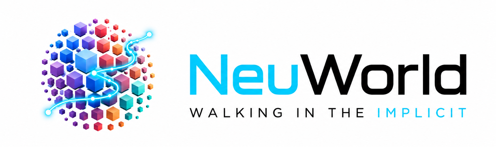
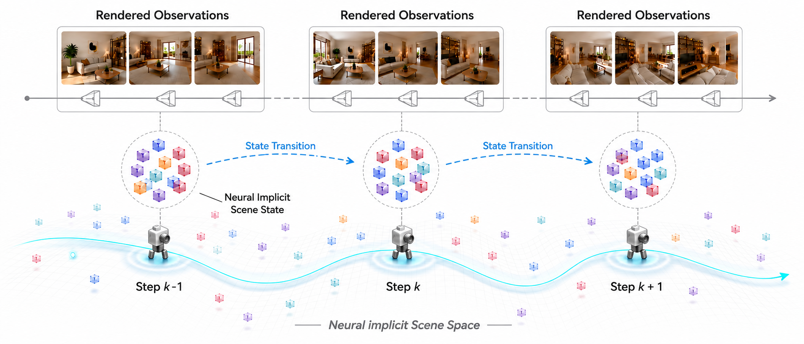
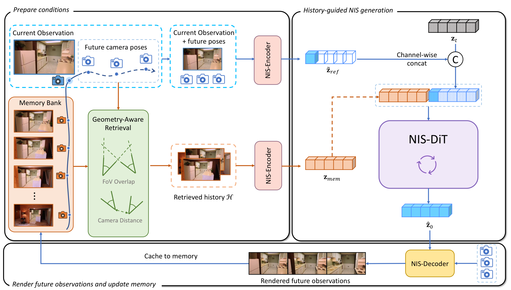

<p align="center">
  
</p>

<h1 align="center">Walking in the Implicit: Interactive World Exploration via Neural Scene Representation</h1>

<p align="center">
  <a href="https://arxiv.org/abs/0000.00000"></a>
  <a href="assets/NeuWorld-arxiv.pdf"></a>
  <a href="https://lizhiqi49.github.io/NeuWorld"></a>
  <a href="https://huggingface.co/your-org/NeuWorld"></a>
  <a href="#citation"></a>
</p>

<p align="center">
  <strong>Code will be released soon.</strong>
</p>

<p align="center">
  <a href="https://lizhiqi49.github.io">Zhiqi Li</a><sup>1,2</sup> &nbsp;
  <a href="https://github.com/forgetable233">Chengrui Dong</a><sup>1,2</sup> &nbsp;
  <a href="https://github.com/duzh11">Zhenhua Du</a><sup>1,2</sup> &nbsp;
  Hangning Zhou<sup>3,&dagger;</sup> &nbsp;
  Cong Qiu<sup>3</sup><br>
  Hailong Qin<sup>3</sup> &nbsp;
  Mu Yang<sup>3</sup> &nbsp;
  <a href="https://wswdx.github.io">Dongxu Wei</a><sup>2</sup> &nbsp;
  <a href="https://ethliup.github.io">Peidong Liu</a><sup>2,*</sup>
</p>

<p align="center">
  <sup>1</sup>Zhejiang University &nbsp;&nbsp;
  <sup>2</sup>Westlake University &nbsp;&nbsp;
  <sup>3</sup>Afari Intelligent Drive<br>
  <sup>&dagger;</sup>Project Lead &nbsp;&nbsp;
  <sup>*</sup>Corresponding Author
</p>

<p align="center">
  
</p>


## News

- The public repository is under internal review. Code and checkpoints will be released soon.
- 🎉🎉 NeuWorld is accepted by ECCV 2026.

## Highlights

- **Scene-centric rollout.** We replace growing video-latent trajectories with a fixed-length, renderable Neural Implicit Scene (NIS) state.
- **Factorized interaction.** Each step decouples stochastic latent scene-state transition from deterministic pose-conditioned rendering.
- **Unified NIS conditioning.** Camera, reference-image, and retrieved history cues are mapped into the same NIS modality instead of separate heterogeneous encoders.
- **Long-horizon consistency.** NeuWorld is designed for camera-controlled exploration with revisitation consistency and favorable inference efficiency.
- **From-scratch training.** The model is trained on public posed-view datasets without pretrained video backbones or auxiliary 3D reconstructors.

## Method Overview

<p align="center">
  
</p>

At each interaction step, the frozen NIS-VAE encoder maps the current observation and a sparse future pose trajectory to a partial NIS condition. Geometry-aware retrieval selects a history set and encodes it as memory NIS tokens. NIS-DiT samples the next local NIS state, and the frozen decoder renders future views under the queried poses.

## Citation

If you find our work useful, please cite:

```bibtex
@inproceedings{li2026neuworld,
  title     = {Walking in the Implicit: Interactive World Exploration via Neural Scene Representation},
  author    = {Li, Zhiqi and Dong, Chengrui and Du, Zhenhua and Zhou, Hangning and Qiu, Cong and Qin, Hailong and Yang, Mu and Wei, Dongxu and Liu, Peidong},
  booktitle = {European Conference on Computer Vision (ECCV)},
  year      = {2026}
}
```
